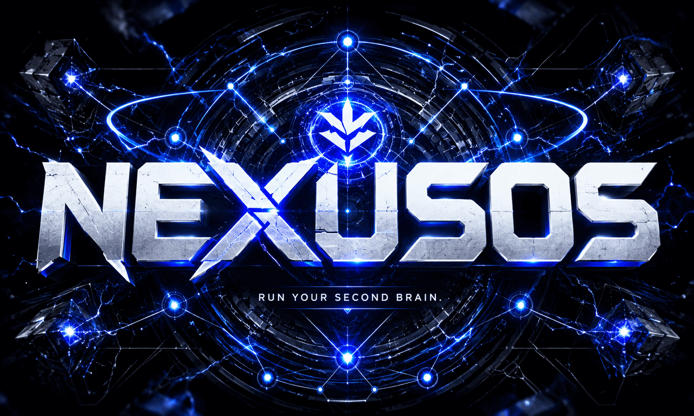

<p align="center">
  
</p>

<p align="center">
  <strong>Files you own. Memory your agents can trust.</strong>
</p>

<p align="center">
  <a href="https://github.com/asimons81/nexusos/actions/workflows/ci.yml"></a>
  
  
  
  <a href="LICENSE"></a>
  <a href="https://x.com/tonysimons_"></a>
</p>

# NexusOS

NexusOS is a local-first knowledge operating system for AI agents. It turns ordinary
folders of Markdown and text files into a structured, searchable memory layer exposed
through a CLI and Model Context Protocol server.

Your source files remain the system of record. NexusOS builds disposable derived state
inside `.nexusos/`, then gives humans and agents deterministic tools to search, browse,
read, inspect links, assemble context, and verify workspace health.

> [!IMPORTANT]
> NexusOS is **pre-release software** at `v0.1.0-alpha.2`. The planned v0.1 core feature
> scope is implemented, but release hardening, packaging validation, cross-platform
> proof, security review, and public contract freeze are still in progress. See the
> [release roadmap](ROADMAP.md).

## Why NexusOS

Agent memory should not require surrendering your notes to a proprietary database or
trusting an opaque retrieval pipeline.

NexusOS is built around a smaller contract:

- **Local first:** core workflows require no hosted account or network connection.
- **Files stay yours:** Markdown and text remain readable without NexusOS.
- **Deterministic retrieval:** SQLite FTS5, stable IDs, source paths, and line ranges make
  results inspectable.
- **Agent native:** the same service layer powers the CLI and MCP tools.
- **Read-only by default:** retrieval never edits source documents.
- **Rebuildable state:** the index can be deleted and regenerated from source files.

## What works today

`v0.1.0-alpha.2` includes:

- safe workspace initialization with blank and starter templates
- path boundaries, deny paths, nested-workspace protection, and doctor checks
- deterministic Markdown and plain-text indexing into SQLite with FTS5
- incremental indexing and content-aware stale-index detection
- ranked search with source paths, headings, snippets, and line ranges
- browse, read, recent, links, and deterministic context navigation
- workspace linting for link, frontmatter, structure, and staleness problems
- MCP over stdio and loopback-first Streamable HTTP
- a read-only local inspection API and bundled UI
- JSON output for automation-friendly command paths

Not included in v0.1: embeddings, vector search, ingestion connectors, guarded source
writes, cloud hosting, OAuth, sync, or multi-user collaboration.

## Quick start

NexusOS is not yet published as a stable PyPI package. Run it from a source
checkout (full instructions: [docs/install.md](docs/install.md)):

```bash
git clone https://github.com/asimons81/nexusos.git
cd nexusos
uv sync

uv run nexusos version
uv run nexusos init ./example-workspace
uv run nexusos doctor --workspace ./example-workspace
uv run nexusos index --workspace ./example-workspace
uv run nexusos status --workspace ./example-workspace
uv run nexusos browse --workspace ./example-workspace
uv run nexusos search "workspace" --workspace ./example-workspace
```

For a disposable end-to-end walkthrough:

```bash
uv run nexusos demo
```

## How it works

```text
Markdown and text files
          │
          ▼
  discovery + parsing
          │
          ▼
 deterministic SQLite index
          │
          ├── CLI search and navigation
          ├── workspace linting
          ├── local inspection API and UI
          └── MCP tools for agents
```

The index is derived state. Source documents are never converted into a proprietary
format and can be recovered without NexusOS because they never left the filesystem.

## CLI

| Command | Purpose |
|---|---|
| `nexusos version` | Print the installed version |
| `nexusos init PATH` | Create or adopt a workspace |
| `nexusos doctor` | Validate workspace health and configuration |
| `nexusos config show` | Display raw or effective configuration |
| `nexusos index` | Build or incrementally update the index |
| `nexusos status` | Report index state, counts, and staleness |
| `nexusos search TERM` | Run ranked FTS5 search |
| `nexusos browse` | List indexed documents |
| `nexusos read ITEM` | Read a document by ID, path, or name |
| `nexusos recent` | List recently modified documents |
| `nexusos links ITEM` | Inspect incoming and outgoing wiki links |
| `nexusos context ITEM` | Build a deterministic evidence packet |
| `nexusos lint --workspace PATH` | Lint a workspace vault |
| `nexusos mcp` | Start the MCP server over stdio |
| `nexusos serve --transport streamable-http` | Start MCP over HTTP |
| `nexusos serve --workspace PATH` | Start the inspection API and UI |
| `nexusos demo` | Run a synthetic end-to-end walkthrough |

Use `nexusos COMMAND --help` for the current option contract. Workspace commands detect
the current workspace unless `--workspace` is supplied.

The CLI commands, options, exit codes, configuration keys/environment variables, JSON
shapes, and MCP tool schemas are frozen for the v0.1 train and inventoried in
[docs/contracts.md](docs/contracts.md). `tests/contracts/` locks the surface; changes
require a deliberate roadmap decision and changelog entry.

## MCP for agents

Start NexusOS as a stdio MCP server:

```bash
nexusos mcp --workspace /path/to/workspace
```

Generic client configuration:

```json
{
  "mcpServers": {
    "nexusos": {
      "command": "nexusos",
      "args": ["mcp", "--workspace", "/path/to/workspace"]
    }
  }
}
```

Available tools:

| Tool | Contract |
|---|---|
| `status` | Index status, counts, and staleness reasons |
| `search` | Ranked full-text search |
| `browse` | Indexed document metadata |
| `read` | Bounded source reading by ID, path, or name |
| `recent` | Recently modified documents |
| `links` | Incoming and outgoing wiki-link state |
| `context` | Deterministic headings, siblings, and linked evidence |
| `index` | Refresh derived state inside `.nexusos/` |

All retrieval tools are read-only. `index` writes only disposable derived state.

MCP Streamable HTTP is loopback-first but unauthenticated. Do not expose it directly to
an untrusted network. See [docs/mcp.md](docs/mcp.md) and [SECURITY.md](SECURITY.md).

## Workspace layout

A starter workspace uses a practical folder convention, not a proprietary storage
format:

```text
workspace/
├── nexusos.toml
├── README.md
├── SCHEMA.md
├── inbox/
├── raw/
│   ├── articles/
│   ├── conversations/
│   ├── notes/
│   └── transcripts/
├── wiki/
│   ├── concepts/
│   ├── entities/
│   ├── projects/
│   ├── queries/
│   └── _archive/
├── ops/
│   ├── decisions/
│   ├── sops/
│   └── workflows/
├── mocs/
├── journal/
└── .nexusos/          # generated state, safe to rebuild
```

Collections and file patterns are configurable in `nexusos.toml`.

## Safety boundary

NexusOS v0.1 is designed for a local, single-user workspace controlled by the operator.

The current contract includes:

- no source-document mutation during indexing, retrieval, linting, or MCP reads
- denied-path and workspace-boundary validation
- nested-workspace prevention
- transactional index writes and an exclusive writer lock
- temporary-file hardening for critical state writes
- loopback defaults for local HTTP transports
- Host validation, Origin checks, and a per-process token for the inspection API

The inspection API and MCP Streamable HTTP are separate surfaces with different security
contracts. The inspection API is token-protected and warns on a non-loopback bind; MCP
Streamable HTTP is unauthenticated and refuses a non-loopback bind unless the operator
explicitly opts in with `--allow-non-loopback` / `NEXUSOS_ALLOW_NON_LOOPBACK=1`. A
non-loopback bind is not a claim that NexusOS is an internet-facing authenticated
service.

Review [SECURITY.md](SECURITY.md) and the active hardening work in
[ROADMAP.md](ROADMAP.md) before using NexusOS outside the supported local boundary.

## Configuration

Workspaces are configured through `nexusos.toml`. Effective values are resolved in this
order, with later layers overriding earlier ones:

1. built-in defaults
2. `nexusos.toml`
3. `NEXUSOS_*` environment variables
4. CLI flags where supported

```bash
nexusos config show
nexusos config show --effective
nexusos config show --json
```

See [docs/configuration.md](docs/configuration.md) for valid keys, defaults, environment
variable names, and alpha limitations.

## Development

```bash
uv sync
uv run ruff check .
uv run ruff format --check .
uv run mypy src
uv run pytest -q
uv run nexusos version
```

Read these before changing the repository:

- [AGENTS.md](AGENTS.md): non-negotiable constraints and task protocol for coding agents
- [CONTRIBUTING.md](CONTRIBUTING.md): contributor setup and pull-request expectations
- [docs/architecture.md](docs/architecture.md): dependency direction and system contracts
- [ROADMAP.md](ROADMAP.md): versioned release tasks and acceptance gates
- [docs/releasing.md](docs/releasing.md): release procedure and evidence checklist

### Agent execution contract

Roadmap work should reference a task ID such as `A3-04` or `RC-03`. Agents must:

1. state the task and acceptance criteria they are implementing
2. inspect implementation and tests before editing behavior or docs
3. preserve architecture boundaries and source immutability
4. add or update tests for behavioral changes
5. run the complete verification gate
6. update affected docs and changelog entries in the same change
7. report evidence, limitations, and deferred work explicitly

“Implemented” without verification evidence is not a completed roadmap task.

## Documentation

| Document | Contents |
|---|---|
| [ROADMAP.md](ROADMAP.md) | Executable plan from alpha to stable |
| [docs/install.md](docs/install.md) | Supported environments, dependencies, install/upgrade, verified artifacts |
| [docs/releases/v0.1.md](docs/releases/v0.1.md) | v0.1 release notes (features, fixes, known issues, verification) |
| [docs/architecture.md](docs/architecture.md) | Layers, dependencies, and invariants |
| [docs/contracts.md](docs/contracts.md) | Frozen CLI, config, JSON, exit-code, and MCP contracts |
| [docs/configuration.md](docs/configuration.md) | TOML schema, environment variables, precedence |
| [docs/mcp.md](docs/mcp.md) | MCP tools, transports, and client setup |
| [docs/linting.md](docs/linting.md) | Workspace and developer lint modes |
| [docs/releasing.md](docs/releasing.md) | Build, validation, and release procedure |
| [SECURITY.md](SECURITY.md) | Supported threat boundary and reporting |
| [CHANGELOG.md](CHANGELOG.md) | Version history |

## Release status

The repository is ready to begin the `v0.1.0-alpha.3` hardening roadmap. Stable release
is blocked on cross-platform full-suite validation, coverage policy, artifact installation
proof, interface freeze, documentation verification, security review, and release
candidate testing.

Follow progress in [ROADMAP.md](ROADMAP.md).

## License

Apache-2.0. See [LICENSE](LICENSE).