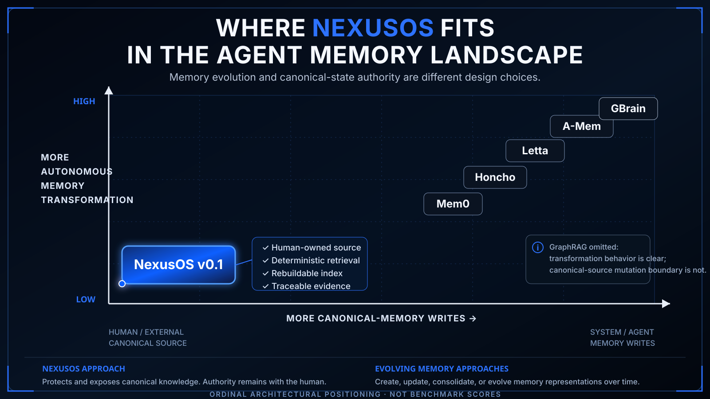

# Where NexusOS Fits in the Agent Memory Landscape

This note explains how NexusOS v0.1 relates to recent agent-memory taxonomies and neighboring memory systems.

It is an architectural positioning document, not a benchmark or ranking.

## Bottom line

NexusOS v0.1 is best described as a **source-grounded, human-owned, deterministic knowledge substrate**.

It keeps Markdown and text files as canonical state, builds rebuildable SQLite/FTS5 retrieval state around them, and returns source-locatable evidence such as paths, headings, snippets, and line ranges.

It is **not** a self-evolving agent-memory system in the strict sense used by the papers reviewed here. NexusOS v0.1 does not provide an autonomous memory-write loop, LLM-based indexing, embeddings, vector search, semantic fact extraction, reflection, or consolidation.

## The research question

Two papers were used as the primary taxonomy references:

1. [Anatomy of Agentic Memory](https://arxiv.org/html/2602.19320)
2. [Agent Memory: Characterization and System Implications of Stateful Long-Horizon Workloads](https://arxiv.org/html/2606.06448v1)

The question was not "which category makes NexusOS sound best?" The question was:

> Given NexusOS v0.1's actual implementation, where does it fit, where does it only partially resemble an existing category, and where does it fall outside the taxonomy entirely?

The NexusOS side of the comparison was pinned to the [`v0.1.0`](https://github.com/asimons81/nexusos/tree/v0.1.0) release rather than `main`.

## Paper #1: Anatomy of Agentic Memory

The first paper treats agentic memory as persistent external memory that participates in a read/write/update process across interactions, then divides systems into structural families such as lightweight semantic, entity/personalized, episodic/reflective, and structured/hierarchical memory.

### NexusOS result

**NexusOS v0.1 does not fit the paper's strict definition of agentic memory as a standalone system.**

NexusOS clearly has durable external state and retrieval, but it does not give the agent a native loop for rewriting or consolidating canonical memory over time.

| Dimension | NexusOS v0.1 | Result |
|---|---|---|
| Persistent external state | Human-owned Markdown/text corpus | Partial |
| Read/retrieval | Deterministic search, read, context, links | Fits |
| Agent write/update loop | No native canonical-source memory mutation loop | Does not fit |
| Lightweight semantic memory | No embedding/vector path in v0.1 | Does not fit |
| Entity/personal memory | No entity/profile memory model | Does not fit |
| Episodic/reflective memory | No reflection or consolidation loop | Does not fit |
| Structured/hierarchical memory | Paths, headings, folders, wiki links | Partial resemblance only |

The important nuance is that NexusOS has **document structure**, but that is not the same as a semantic graph, tiered memory hierarchy, or self-maintaining structured memory system.

## Paper #2: Agent Memory paradigms

The second paper separates memory architectures into long-context approaches, Flat RAG, Structure-Augmented RAG, consolidating memory, and agent-controlled memory.

### NexusOS result

NexusOS does **not** cleanly fit any full paradigm in the paper.

Its retrieval mechanism most closely resembles the deterministic lexical side of **Flat RAG**:

- no LLM is required to construct the index
- no embeddings are required
- retrieval is lexical and deterministic
- SQLite FTS5/BM25 provides ranked search

But that resemblance is at the **retrieval-mechanism level**, not the entire memory architecture.

The paper's Flat RAG framing is centered on memory derived from an agent interaction stream. NexusOS instead indexes a current, human-authored canonical corpus whose derived index can be discarded and rebuilt as the source changes.

So the accurate statement is:

> NexusOS v0.1 uses deterministic lexical retrieval mechanics similar to Flat RAG, but it is not itself a Flat RAG agent-memory system under the paper's full workload definition.

## Why source authority matters

The research exposed a useful distinction that is not emphasized as a primary classifier in either taxonomy:

### Canonical-state authority

Who decides what counts as truth?

With NexusOS v0.1, the answer is the **human-owned source corpus**. The retrieval index is derived state, not an independently authoritative memory store.

### Rebuildability

Can the derived memory state be deleted and reconstructed from canonical source?

With NexusOS v0.1, yes. The `.nexusos/` index exists to accelerate and structure retrieval, not to replace the source corpus.

### Evidence traceability

Can retrieved information be traced back to independently readable source material?

NexusOS is designed around stable source coordinates such as paths, headings, snippets, and line ranges.

These three axes are useful because two systems can look similar from a retrieval perspective while making very different decisions about authority and memory evolution.

## Neighboring systems

The comparison below is intentionally architectural rather than competitive.

| System | General memory behavior | Relationship to NexusOS |
|---|---|---|
| [Mem0](https://github.com/mem0ai/mem0) | Extracts and maintains learned memory representations; supports semantic retrieval | More mutable/evolving; potentially complementary to a source evidence layer |
| [Honcho](https://github.com/plastic-labs/honcho) | Maintains reasoning and representations across sessions/peers | Evolving interaction-memory layer |
| [Microsoft GraphRAG](https://github.com/microsoft/graphrag) | Uses LLM-driven extraction to build structured graph materialization | Semantic transformation layer rather than the same source-policy model |
| [Letta](https://docs.letta.com/configuration/memory) | Agent-editable memory with active memory management | Explicit agent-authorized memory evolution |
| [A-Mem](https://github.com/WujiangXu/A-mem) | Dynamically organizes, links, and evolves memories | Explicit evolving agent memory |
| [GBrain](https://github.com/garrytan/gbrain) | Markdown-friendly brain with hybrid retrieval, graph behavior, writes, enrichment, and consolidation | Similar interest in inspectable knowledge, but substantially more autonomous and mutating |

NexusOS can overlap with these systems at the "retrieve durable knowledge for an agent" layer, but it can also sit **under or beside** an evolving memory system as an evidence substrate.

For example, a composite architecture could keep project or world knowledge in a NexusOS-indexed corpus while a separate memory system stores learned preferences, summaries, or interaction state.

That is an architectural pattern, not a claim that such an integration ships in NexusOS v0.1.

## The diagram

The diagram uses two qualitative axes:

- **vertical:** more autonomous memory transformation
- **horizontal:** more canonical-memory writes

NexusOS occupies the low-transformation, human/external-authority corner because its normal retrieval/indexing path preserves the canonical source corpus and treats the index as derived state.

Mem0, Honcho, Letta, A-Mem, and GBrain are shown in the higher-transformation/system-managed region because their documented designs include materially more memory extraction, writing, updating, enrichment, consolidation, or evolution.

The positions are **ordinal architectural placement only**. They are not measured coordinates, scores, or rankings.

GraphRAG is omitted from the plotted points because its semantic transformation behavior is clear, but this research did not establish a precise enough original-source mutation boundary for the horizontal axis.

## Claims we can safely make

1. NexusOS v0.1 keeps ordinary source files canonical and builds derived local retrieval state around them.
2. Its v0.1 retrieval path is deterministic lexical FTS5/BM25 rather than embedding/vector search.
3. Retrieval can return source-level provenance such as paths, headings, snippets, and line ranges.
4. Normal indexing and retrieval preserve an existing canonical corpus.
5. NexusOS can serve as a source-grounded evidence layer in a larger agent architecture.

## Claims we should not make

1. **"NexusOS is agentic memory."** That overstates its fit under the strict write/evolution definitions in the reviewed papers.
2. **"NexusOS is a knowledge graph."** Explicit wiki links are not semantic entity/relation extraction.
3. **"NexusOS has semantic/vector search."** v0.1 does not.
4. **"NexusOS never writes any source file."** Workspace initialization and demo flows can create scaffolding/sample content; the normal indexing/retrieval path is the source-preserving contract.
5. **"NexusOS replaces evolving memory systems."** The systems make different architectural choices and can be complementary.

## Positioning statement

**NexusOS is the deterministic, human-owned evidence substrate for agents, not the autonomous memory system that rewrites itself.**

## Sources

- [Anatomy of Agentic Memory](https://arxiv.org/html/2602.19320)
- [Agent Memory: Characterization and System Implications of Stateful Long-Horizon Workloads](https://arxiv.org/html/2606.06448v1)
- [NexusOS v0.1.0](https://github.com/asimons81/nexusos/tree/v0.1.0)
- [Mem0](https://github.com/mem0ai/mem0)
- [Honcho](https://github.com/plastic-labs/honcho)
- [Microsoft GraphRAG](https://github.com/microsoft/graphrag)
- [Letta memory documentation](https://docs.letta.com/configuration/memory)
- [A-Mem](https://github.com/WujiangXu/A-mem)
- [GBrain](https://github.com/garrytan/gbrain)
